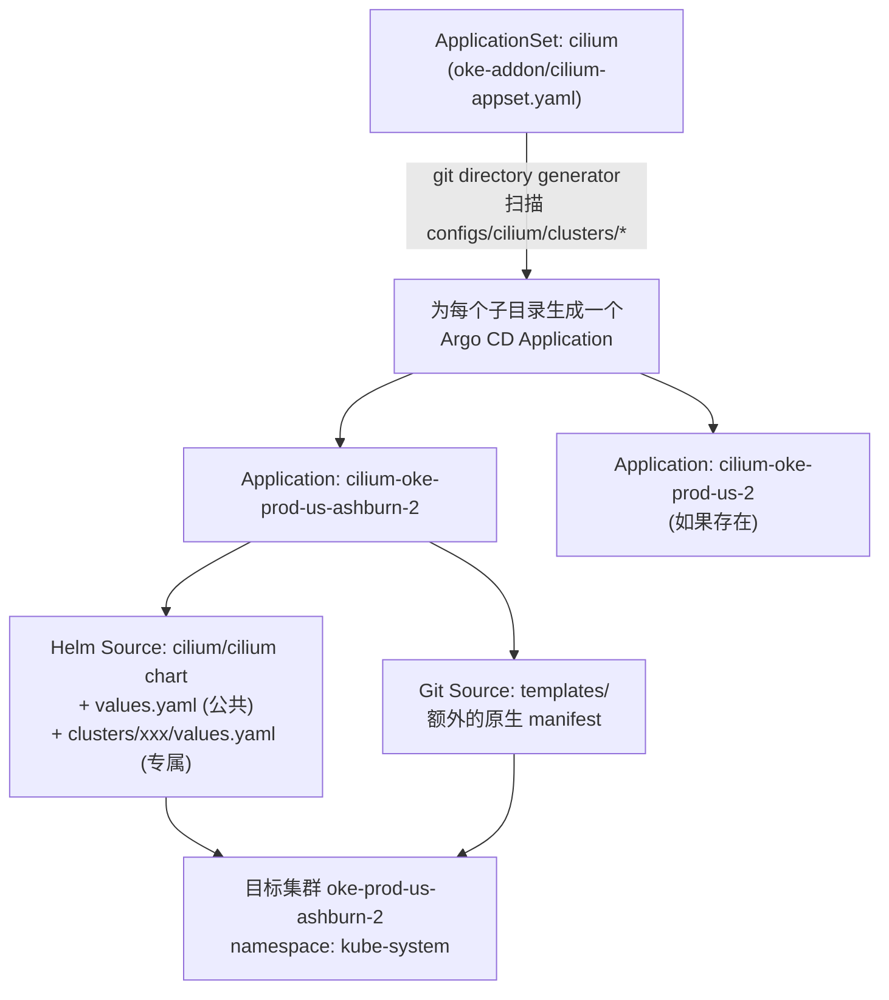

网上关于「OKE 把 CNI 从 Flannel 换成 Cilium」的教程不少，比如 [Pratik Borkar 的这篇](https://blog.pratiknborkar.com/replace-flannel-with-cilium-on-oke) 和 [Oracle 官方的 Learn 教程](https://docs.oracle.com/en/learn/oke-flannel-to-cilium-cni-plugin/index.html)，写得都很扎实。但它们都是「站在一台笔记本前敲命令」的视角：`helm repo add`、手改一份几百行的 `cilium.yaml`、`helm install`，最后再手动 `kubectl delete daemonset kube-flannel-ds`——这一步在我们的场景里其实行不通（下面第 6 步会讲为什么）。

这套流程在**一个**集群上没问题。但当你手上有好几个 OKE 集群——生产、生产的第二个 region、专门跑 ops 组件的集群、还有 QA 环境——手工敲命令的方式很快就会出问题：配置漂移（这个集群改了参数忘记同步到那个集群）、没有变更记录（谁在什么时候把 `kubeProxyReplacement` 打开的？）、也没有办法方便地做 diff/回滚。

所以这篇文章记录的是我们实际在生产里怎么做的：**用 ArgoCD 的 ApplicationSet，把 Cilium 的安装和多集群管理全部变成 GitOps**。文章结构会尽量对照前面提到的两篇教程，但每一步都换成我们的 ArgoCD 视角。

> 早期我们其实也是手工维护几份 `values-common.yaml` + `values-cluster-xxx.yaml`，写过脚本 `./deploy.sh cluster-beijing` 这种土办法。用起来发现最大的问题不是配置本身，而是**执行这件事的动作**没有被管住——脚本谁跑了、什么时候跑的、跑完集群状态是不是真的和文件一致，全靠人肉。这也是后来切到 ArgoCD 的直接原因。


---

## 1. 为什么要把 Flannel 换成 Cilium

先快速过一遍动机，这部分和网上文章的结论差不多：

| 能力 | Flannel | Cilium |
|---|---|---|
| 转发实现 | VXLAN overlay + iptables | eBPF，内核态转发 |
| kube-proxy | 需要，iptables 规则随 Service 数量线性增长 | 可以完全替代（`kubeProxyReplacement`） |
| NetworkPolicy | 不支持 | L3/L4 完整支持，L7（HTTP/gRPC/Kafka）也支持 |
| 可观测性 | 无内建方案 | Hubble：flow 级别的可视化、metrics、trace |
| 多集群互联 | 无 | ClusterMesh |
| Gateway API | 需要额外装 ingress/gateway 实现 | 内建 Envoy，原生支持 Gateway API |

对我们来说，最直接的驱动力其实是 **Hubble 的可观测性**和**Gateway API 原生支持**——这样就不用再单独维护一套 ingress-nginx 之类的组件，网络策略、流量可视化、南北向流量入口，Cilium 一个组件就能覆盖。

---

## 2. 为什么用 ArgoCD ApplicationSet，而不是手工 Helm

手工流程（两篇参考文章里的做法）大致是：

```bash
helm repo add cilium https://helm.cilium.io/
helm show values cilium/cilium > cilium.yaml
nano cilium.yaml   # 手改一堆字段
helm install cilium cilium/cilium -n kube-system -f cilium.yaml
```

这套流程有三个问题在多集群场景下会被放大：

1. **配置和执行分离**：`cilium.yaml` 可能在某人的笔记本上，谁改过、改了什么，没有记录。
2. **没有 drift 检测**：如果有人在集群上手动 `kubectl edit` 了 Cilium 的某个 Deployment，没人会发现，直到出问题。
3. **多集群 = 多份重复劳动**：3 个集群就要手敲 3 遍，还要保证公共参数（比如 Hubble 的 metrics 配置）在 3 个集群里完全一致。

ArgoCD 的 **ApplicationSet + git 目录生成器（directory generator）** 刚好是为这个场景设计的：**一份模板 + 一个 Git 目录结构，自动为每个集群生成一个 Argo CD Application**。加上 `automated.selfHeal`，任何手动改动都会被自动纠正回 Git 里声明的状态。

---

## 3. 整体架构

我们的 Git 仓库里，Cilium 迁移相关的内容分成三部分：Cilium 本身的 ApplicationSet 定义、Cilium 的公共/分集群配置，以及第 8 节会讲到的「让 flannel/kube-proxy 退役」的 patch：

```
devops/
└── argocd-apps/
    ├── oke-addon/
    │   └── cilium-appset.yaml          # ApplicationSet 定义
    └── configs/
        ├── cilium/
        │   ├── values.yaml              # 所有集群共享的公共配置
        │   ├── clusters/
        │   │   └── oke-prod-us-ashburn-2/
        │   │       └── values.yaml      # 该集群独有的覆盖配置
        │   └── templates/
        │       └── clustermesh-remote-users.yaml  # 额外的原生 K8s manifest
        └── kube-proxy-patch/
            └── clusters/
                └── oke-prod-us-ashburn-2/
                    ├── flannel-nodeaffinity.yaml     # 让 flannel 调度不到任何节点
                    └── kube-proxy-nodeaffinity.yaml  # 让 kube-proxy 调度不到任何节点
```

`kube-proxy-patch/clusters/<cluster>/` 和 `cilium/clusters/<cluster>/` 是同一种「目录即拓扑」的组织方式——新增一个集群时，这两个目录下都要对应加一份文件。这两份 patch 具体做了什么、为什么不直接 `kubectl delete`，第 8 节的第 6 步会详细展开。

数据流大致是这样：



换句话说：**新增一个集群 = 在 `clusters/` 下新建一个目录、写一个几行的 values.yaml、push 到 git**。剩下的事情——创建 namespace、装 chart、同步、纠偏——全部交给 ArgoCD。

---

## 4. ApplicationSet 逐段解读

先看 `oke-addon/cilium-appset.yaml`：

```yaml
apiVersion: argoproj.io/v1alpha1
kind: ApplicationSet
metadata:
  name: cilium
  namespace: argocd
spec:
  goTemplate: true
  goTemplateOptions: ["missingkey=error"]
  generators:
  - git:
      repoURL: https://github.com/<your-org>/devops.git
      revision: dev
      directories:
      - path: argocd-apps/configs/cilium/clusters/*
  template:
    metadata:
      name: 'cilium-{{.path.basename}}'
      namespace: argocd
      labels:
        cluster: '{{.path.basename}}'
        app: cilium
    spec:
      project: devops
      sources:
      - chart: cilium
        repoURL: https://helm.cilium.io/
        targetRevision: 1.19.4
        helm:
          releaseName: cilium
          valueFiles:
            - "$values/argocd-apps/configs/cilium/values.yaml"
            - "$values/{{.path.path}}/values.yaml"
      - repoURL: https://github.com/<your-org>/devops.git
        targetRevision: dev
        ref: values
      - repoURL: https://github.com/<your-org>/devops.git
        targetRevision: dev
        path: argocd-apps/configs/cilium/templates
      destination:
        namespace: kube-system
        name: '{{.path.basename}}'
      syncPolicy:
        syncOptions:
        - CreateNamespace=true
        - ServerSideApply=true
        automated:
          prune: true
          selfHeal: true
      ignoreDifferences:
      - group: apps
        kind: Deployment
        jsonPointers:
        - /spec/replicas
```

几个值得展开讲的点：

- **`git` directory generator**：ApplicationSet 会去扫描 `argocd-apps/configs/cilium/clusters/*`，**每一个子目录**都会生成一个 Application。目录名（`path.basename`）直接变成集群标识，比如 `oke-prod-us-ashburn-2`。这意味着加一个集群不需要改 ApplicationSet 本身，只需要加一个目录。
- **三个 `sources`**：这是一个 Argo CD 的多源 Application（multi-source）。
  1. 第一个 source 是真正的 Helm chart（`cilium/cilium`），它引用了两份 `valueFiles`：一份是全局公共的 `values.yaml`，一份是 `$values/{{.path.path}}/values.yaml`——也就是当前这个集群目录下的专属配置。**后加载的文件会覆盖前面的同名字段**，这就是「公共配置 + 每集群覆盖」的实现方式。
  2. 第二个 source（`ref: values`）只是把 git 仓库作为一个「值引用源」挂进来，本身不产生资源，专门给第一个 source 的 `$values` 占位符提供文件内容。
  3. 第三个 source 指向 `templates/` 目录，用来部署一些 Helm chart 本身没有覆盖到的原生 K8s manifest（后面会讲这个目录里放了什么）。
- **`destination.name: '{{.path.basename}}'`**：用的是 Argo CD 里注册的集群**名字**而不是 API Server 的 URL。这要求你在 Argo CD 里注册集群时，起的名字要和 `clusters/` 下的目录名对得上——这其实是一种「约定优于配置」，保证目录结构本身就是集群拓扑的唯一真相来源。
- **`ServerSideApply=true`**：Cilium 的 CRD（比如 `CiliumNetworkPolicy`）和一些字段较多的资源，用 client-side apply 容易撞上 `metadata.annotations` 大小限制，改成 server-side apply 是社区里的常见推荐做法。
- **`automated.prune + selfHeal`**：这两个开关就是「GitOps 自愈」的核心——有人手动 `kubectl edit` 改了 Cilium 的资源，ArgoCD 会在下一次 reconcile 时把它改回 Git 里的样子；如果在 Git 里删掉了某个字段/资源，集群里对应的也会被清理掉。
- **`ignoreDifferences` 忽略 `Deployment.spec.replicas`**：Cilium Operator 等组件的副本数可能会被 HPA 或者其他控制器动态调整，如果不加这条，ArgoCD 会一直认为集群「偏离了期望状态」并试图把副本数改回 chart 默认值，跟 HPA 打架。这是一条从「Argo CD 状态一直是 OutOfSync」这个坑里总结出来的经验。

---

## 5. 公共配置 `values.yaml` 逐项拆解

这是所有集群共享的一份配置，放在 `configs/cilium/values.yaml`。我把它按功能分组讲：

### 5.1 基础网络与调度

```yaml
namespaceOverride: "kube-system"
k8sServiceHost: "10.x.x.x"
k8sServicePort: 6443
tolerations:
  - operator: Exists
```

- `k8sServiceHost/k8sServicePort` 显式指向 API Server：一旦启用 `kubeProxyReplacement`，Cilium 自己接管了 Service 的负载均衡，这时候**不能再依赖 `kubernetes.default.svc` 这个 ClusterIP**（它本身就是 kube-proxy/Cilium 要实现的东西），必须直接告诉 Cilium API Server 的真实地址，否则会出现"鸡生蛋"的死锁。
- `tolerations: - operator: Exists`：让 Cilium 的 DaemonSet 能调度到**所有**节点，包括那些打了各种业务 taint 的节点池。CNI 组件必须跑在每一个节点上，不能因为节点有 taint 就漏掉。

### 5.2 性能与转发模式

```yaml
bpf:
  masquerade: true
socketLB:
  enabled: true
ipam:
  mode: "kubernetes"
kubeProxyReplacement: true
```

- `bpf.masquerade: true`：把 SNAT masquerade 也交给 eBPF 做，而不是留一部分给 iptables，进一步减少 iptables 依赖。
- `socketLB.enabled: true`：在 socket 层做负载均衡（而不是等包到了网卡再做 DNAT），东西向流量（Pod 访问 ClusterIP）延迟更低。
- `kubeProxyReplacement: true`：这是从 Flannel 迁移过来后**最大的变化**——kube-proxy 可以被完全移除，Service 的负载均衡全部由 Cilium eBPF 程序实现。

### 5.3 Gateway API

```yaml
gatewayAPI:
  enabled: true
  gatewayClass:
    create: auto
  # 保留客户端真实源 IP（cilium-envoy 为 per-node，每节点都有 endpoint，Local 无黑洞风险）
  externalTrafficPolicy: Local
```

这一段值得多说两句。启用 Gateway API 之后，Cilium 自带的 Envoy 就能当南北向流量入口用，不用再单独装 ingress-nginx。这里选 `externalTrafficPolicy: Local` 而不是默认的 `Cluster`，是为了**保留客户端的真实源 IP**（`Cluster` 模式下请求可能经过一次跨节点转发，源 IP 会被 SNAT 掉）。

`Local` 模式通常的顾虑是「黑洞流量」——如果某个节点上没有目标 Pod 的 endpoint，流量打到这个节点就会被直接丢弃。但因为 Cilium 的 `cilium-envoy` 是以 **per-node DaemonSet** 形式运行的，每个节点上都有一份 Envoy endpoint，所以不存在这个风险，这也是配置里留的那行注释想说明的事。

### 5.4 Hubble 可观测性（含一个真实踩过的坑）

```yaml
hubble:
  enabled: true
  metrics:
    enabled:
      - dns
      - drop
      - tcp
      - flow
      - port-distribution
      - icmp
      - httpV2:exemplars=true;labelsContext=source_namespace,source_workload,destination_namespace,destination_workload,traffic_direction
    enableOpenMetrics: false
    serviceMonitor:
      enabled: true
  tls:
    enabled: false
  relay:
    enabled: true
  ui:
    enabled: true
```

这里最值得记录的是一次线上事故级别的教训。`httpV2` 这个 metric 最初我们是带上 `source_ip,destination_ip` 标签的，方便按 IP 排查问题。但因为我们的入口是走公网的，**客户端 IP 几乎是无界的**——每一个不同的公网 IP 都会在 Prometheus/Cortex 里生成一条新的 time series。结果 `hubble_http_request_duration_seconds_bucket` 这一个 metric 的基数（cardinality）迅速冲到几万，直接打爆了 Cortex 的 per-metric series limit（我们的限制是 50000）。

解决办法很简单粗暴：把 `source_ip`、`destination_ip` 从 `labelsContext` 里去掉，只保留 namespace/workload 级别的标签——这些是有限集合，不会无限增长。真正需要按客户端 IP 排查的场景，改成从 nginx/gateway 的 `X-Forwarded-For` 头里查，和 Hubble metrics 解耦。

> 这是一个通用教训：**任何带「无界值」（公网 IP、请求 ID、时间戳）的字段都不要放进 metrics 的 label，只能放进日志或者 trace。**

### 5.5 Envoy 的权限

```yaml
envoy:
  enabled: true
  securityContext:
    capabilities:
      envoy:
        - NET_BIND_SERVICE
        - NET_ADMIN
        - SYS_ADMIN
        - NET_RAW
      keepCapNetBindService: true
```

因为 Envoy 要监听 80/443 这类特权端口（`NET_BIND_SERVICE`），还要参与 eBPF 相关的网络操作（`NET_ADMIN`/`NET_RAW`），所以需要这几个 Linux capability，而不是完整的 `privileged: true`——这是最小权限原则的体现。

### 5.6 Prometheus 集成

```yaml
prometheus:
  metricsService: true
  enabled: true
  serviceMonitor:
    enabled: true
    labels:
      instance: primary
operator:
  prometheus:
    serviceMonitor:
      enabled: true
      labels:
        instance: primary
```

`labels.instance: primary` 这个标签是配合我们多套 Prometheus/Cortex 实例的路由规则用的——不同 `instance` 标签的 ServiceMonitor 会被不同的 Prometheus Operator 实例抓取，避免多套监控系统抢同一批 target。

### 5.7 ClusterMesh 预留

```yaml
clustermesh:
  useAPIServer: true
```

我们现在还没有真正把多个集群 mesh 到一起，但提前把 `clustermesh-apiserver` 打开，是为了后续做**跨集群服务发现**（比如生产的两个 region 之间）做准备——这也是为什么 `templates/` 目录下已经放了一个 `clustermesh-remote-users` 的 ConfigMap 占位（见第 7 节）。

---

## 6. 每个集群自己的覆盖配置

`clusters/oke-prod-us-ashburn-2/values.yaml`：

```yaml
---
k8sServiceHost: "10.x.x.x"
cluster:
  name: oke-prod-us-ashburn-2
  id: 2
```

只有三行，但每一行都很关键：

- `k8sServiceHost`：每个 OKE 集群的私有 API Endpoint IP 都不一样，这个必须按集群覆盖，不能放公共配置里。
- `cluster.name` / `cluster.id`：这是 ClusterMesh 要求的**全局唯一**标识（`id` 取值范围 1-255）。哪怕现在没启用 mesh，也建议从第一天就把每个集群的 id 定好、写进 git，避免以后要临时给正在跑的集群"改名字"（Cilium 换 cluster id 是有风险的，涉及到 identity 重新分配）。

新增一个集群的动作，实际上就是新建一个类似上面的目录+文件，git push，ApplicationSet 会在下一次 refresh（默认 3 分钟一次，也可以手动 `argocd app list` 触发）时自动发现并创建对应的 Application。

---

## 7. `templates/` 目录：Helm values 覆盖不到的东西

```yaml
# templates/clustermesh-remote-users.yaml
apiVersion: v1
kind: ConfigMap
metadata:
  name: clustermesh-remote-users
  namespace: kube-system
data: {}
```

Cilium 的 Helm chart 不是万能的——有些配套资源（比如给 ClusterMesh 远端集群用的用户/密钥 ConfigMap）需要用原生 manifest 补充。ApplicationSet 里第三个 `source` 就是专门指向这个目录，让它和 Helm chart 的输出一起被同一个 Application 管理、一起同步、一起体现在同一份 `kubectl diff` 里。目前这个 ConfigMap 还是空的（`data: {}`），是给未来接入 ClusterMesh 预留的骨架。

---

## 8. 实际迁移一个集群的步骤

结合上面的架构，把 Flannel 换成 Cilium 的实际操作是这样的（对照开头两篇文章的"手工八步"，这里是"GitOps 版"）：

**第 1 步：确认集群现状**

```bash
kubectl get ds -n kube-system | grep flannel
# kube-flannel-ds   3   3   3   ...
```

**第 2 步：在 git 里为这个集群补一个目录**（如果 ApplicationSet 已经存在、只是新加一个集群）：

```bash
mkdir -p argocd-apps/configs/cilium/clusters/oke-prod-us-ashburn-2
cat > argocd-apps/configs/cilium/clusters/oke-prod-us-ashburn-2/values.yaml <<'EOF'
k8sServiceHost: "<该集群私有 API endpoint IP>"
cluster:
  name: oke-prod-us-ashburn-2
  id: 2
EOF
git add . && git commit -m "add cilium config for oke-prod-us-ashburn-2" && git push
```

**第 3 步：等 ApplicationSet 生成 Application，并首次同步**

```bash
argocd app list | grep cilium-oke-prod-us-ashburn-2
argocd app sync cilium-oke-prod-us-ashburn-2
```

这一步之后，集群里会**同时存在** Flannel 和 Cilium 两套 CNI——这是所有迁移教程里都强调的过渡态，正常现象。

**第 4 步：用 `cilium` CLI 验证状态**

```bash
cilium status
cilium connectivity test
```

**第 5 步：处理"未被 Cilium 接管"的 Pod**

安装 Cilium 之前就已经在跑的 Pod（比如 `kube-dns`、`clustermesh-apiserver` 自己）用的还是旧的网络栈，需要重建一次：

```bash
curl -sLO https://raw.githubusercontent.com/cilium/cilium/main/contrib/k8s/k8s-unmanaged.sh
chmod +x k8s-unmanaged.sh
./k8s-unmanaged.sh
# 逐个删除脚本列出来的 pod，让它们用 Cilium 网络重新调度
```

**第 6 步：让 Flannel 和 kube-proxy "退役"（而不是真的删除）**

网上的教程到这一步基本都是 `kubectl delete daemonset kube-flannel-ds`，但我们**没有真的删**。原因是我们的 OKE 集群是用 Terraform 创建的，`kube-flannel-ds`、`kube-proxy` 这两个 DaemonSet 是集群创建时随 OKE 自带下发的资源——如果手动 `kubectl delete`，下一次 `terraform apply`（哪怕只是改了完全无关的字段）大概率会把它们重新建出来，等于白删。

我们的做法是给这两个 DaemonSet 的 Pod 模板打一个 `nodeAffinity` patch，要求调度到一个**没有任何节点会有**的 label 上，让调度器永远找不到可用节点——已有的 Pod 会被驱逐，也不会再有新 Pod 起来，但 DaemonSet 这个资源本身还在，Terraform 眼里"资源存在"的期望没有被打破，不会触发重建：

```yaml
# flannel-nodeaffinity.yaml
apiVersion: apps/v1
kind: DaemonSet
metadata:
  name: kube-flannel-ds
  namespace: kube-system
spec:
  selector:
    matchLabels:
      app: flannel
      tier: node
  template:
    metadata:
      labels:
        app: flannel
        tier: node
    spec:
      affinity:
        nodeAffinity:
          requiredDuringSchedulingIgnoredDuringExecution:
            nodeSelectorTerms:
            - matchExpressions:
              - key: node.kubernetes.io/flannel-disabled
                operator: Exists
```

```yaml
# kube-proxy-nodeaffinity.yaml
apiVersion: apps/v1
kind: DaemonSet
metadata:
  name: kube-proxy
  namespace: kube-system
spec:
  selector:
    matchLabels:
      k8s-app: kube-proxy
  template:
    metadata:
      labels:
        k8s-app: kube-proxy
    spec:
      affinity:
        nodeAffinity:
          requiredDuringSchedulingIgnoredDuringExecution:
            nodeSelectorTerms:
            - matchExpressions:
              - key: node.kubernetes.io/kube-proxy-disabled
                operator: Exists
```

`node.kubernetes.io/flannel-disabled`、`node.kubernetes.io/kube-proxy-disabled` 这两个 label 我们从来不会真的打到任何节点上，所以这个 `requiredDuringSchedulingIgnoredDuringExecution` 条件永远无法满足。因为只写了 `template.spec.affinity` 这一小段而不是完整的 DaemonSet spec，这两份 manifest 只能靠 **Server-Side Apply**（第 4 节提到的 `ServerSideApply=true`）以字段级合并的方式打进去——client-side apply 会因为缺字段直接报错或整体覆盖，起不到"只改 affinity、其他都不动"的效果。

这套 patch 和 Cilium 本身一样，也纳入同一套 Git 目录结构里按集群管理（`argocd-apps/configs/kube-proxy-patch/clusters/<cluster>/*.yaml`），和第 3 节里 `clusters/<cluster>/values.yaml` 是同一种"目录即拓扑"的思路，跟着 GitOps 流程走，而不是手工敲一次性命令。

**第 7 步：最终验证**

```bash
cilium status
# Cluster Pods: 7/7 managed by Cilium
kubectl get pods -n kube-system | grep -i "proxy\|flannel"
# 应该看不到运行中的 kube-proxy / flannel pod
kubectl get daemonset kube-proxy kube-flannel-ds -n kube-system
# 但 DaemonSet 资源本身还在，DESIRED/CURRENT/READY 应该都是 0
```

除了这些命令行验证之外，别忘了打开 Hubble UI 看看流量图是不是符合预期——这也是切换 CNI 之后最直观的"验收标准"。

---

## 9. GitOps 化之后到底多赚了什么

和最初手工 `helm install` 的方式比，这套 ApplicationSet 方案换来的东西：

- **新增集群的成本是线性的、可预测的**：一个目录、几行 yaml，而不是重新走一遍手工八步。
- **配置漂移会被自动纠正**：`selfHeal` 让"有人手动改了线上配置但没同步回 git"这种情况不再是隐患。
- **变更是可审计的**：任何一次 Cilium 参数调整，都是一次 PR，能看到是谁、什么时候、为什么改的（比如前面提到的 Hubble metrics 基数事故，我们就是在 git log 里留了一行注释和日期）。
- **公共配置和集群专属配置天然分离**：改一次 `values.yaml` 就能同时影响所有集群，改 `clusters/xxx/values.yaml` 只影响一个集群，心智负担很低。

当然代价也是有的：ApplicationSet 本身的调试不算直观（比如 `goTemplateOptions: ["missingkey=error"]` 意味着如果模板里引用了一个不存在的字段，整个渲染会直接报错而不是留空，排查起来需要对着 ApplicationSet controller 的日志看）；多 `sources` 的 Application 在 Argo CD UI 里展示 diff 时也不如单 source 直观。总体是"前期多花一点心思搭骨架，后期维护成本大幅下降"的典型权衡。

---

## 10. 小结

从 Flannel 换到 Cilium 这件事本身，网上的教程已经讲得很清楚了：装 Cilium、等它接管所有 Pod、删掉 Flannel。真正决定这件事能不能在生产环境安全、可重复地做下去的，其实是**怎么管理配置和执行过程**。

我们的答案是：把「一份共享配置 + N 份集群专属覆盖 + 额外的原生 manifest」全部丢进 Git，用 ApplicationSet 的目录生成器自动映射到每个集群的 Argo CD Application，再靠 `selfHeal` 兜底配置漂移。下一步计划是真正把 `clustermesh.useAPIServer` 用起来，把生产的两个 region 用 ClusterMesh 连通，做跨集群的服务发现——到时候应该会再写一篇。

---

*参考资料：*
- *[Replace Flannel with Cilium on OKE - Pratik Borkar](https://blog.pratiknborkar.com/replace-flannel-with-cilium-on-oke)*
- *[Migrate from the Flannel to the Cilium CNI plugin on OKE - Oracle](https://docs.oracle.com/en/learn/oke-flannel-to-cilium-cni-plugin/index.html)*
