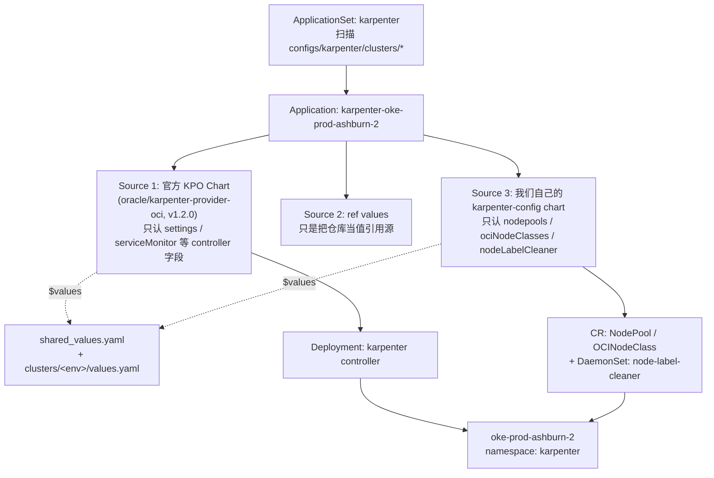

[Karpenter Provider for OCI](https://github.com/oracle/karpenter-provider-oci)（下面简称 KPO）是 Oracle 官方维护的、把 [Karpenter](https://karpenter.sh/) 这套"按 Pod 需求直接算节点"的弹性伸缩方案移植到 OKE 上的实现。它是什么、`NodePool`/`OCINodeClass` 这两个 CRD 怎么设计的，[官方 GitHub](https://github.com/oracle/karpenter-provider-oci) 和 [Oracle 文档](https://docs.oracle.com/en-us/iaas/Content/ContEng/Tasks/conteng-kpo.htm) 已经写得很全了。这篇文章记录的是另一件事：**我们把 KPO 接进 ArgoCD 之后，为什么又在它前面自己包了一层 Terraform + Helm，以及这一路踩过的几个坑**。


---

## 1. 为什么从 Cluster Autoscaler 换到 Karpenter

我们新建的几个 OKE 集群里，Terraform 的 `worker_pools` 只声明了一个兜底节点池，Cluster Autoscaler 相关的输入直接传了个空 map：

```hcl
# 不安装 ClusterAutoscaler add-on（空 map => 模块内 addon count=0），改用 Karpenter
cluster_autoscaler = {}
```

动机很直接：Cluster Autoscaler 是"节点池粒度"的伸缩——它只会在你预先定义好的某个节点池模板里加减副本数，节点规格、是否用 Spot、AD 怎么分布，都得你提前想好、按节点池拆分。Karpenter 反过来，是"实例粒度"的伸缩：它直接看未调度 Pod 的资源请求和调度约束，实时决定该开一台什么规格、什么可用域、Spot 还是按需的机器，不需要预先枚举节点池。

| 能力 | Cluster Autoscaler | Karpenter (KPO) |
|---|---|---|
| 伸缩粒度 | 节点池（固定规格） | 单个实例（按 Pod 需求现算规格） |
| Spot 支持 | 需要单独的 Spot 节点池 | `capacity-type` 一个 requirement 搞定 |
| Bin packing / 整合 | 无 | `consolidationPolicy` 自动合并低利用率节点 |
| 节点自愈 | 无 | `featureGates.nodeRepair`，NotReady 超时自动替换 |
| 灵活 Shape（Flex CPU/内存组合） | 每个组合一个节点池 | 一个 `OCINodeClass` 里罗列多套 `shapeConfigs` |
| 新增一种规格 | 改 Terraform、加节点池、apply | 改一份 `values.yaml`，git push |

对我们来说最后一行最关键：Cluster Autoscaler 时代，"给某个 workload 加一种新的机器规格"意味着一次 Terraform apply；换成 Karpenter 之后，这变成了纯 GitOps 的一次 PR。

---

## 2. KPO 项目本身：两个 CRD 撑起的架构

KPO 沿用了 AWS Karpenter 的核心模型，但换成了 OCI 的资源和 API：

- **`OCINodeClass`**：描述"怎么在 OCI 上开一台机器"——镜像（`imageId`/`imageType`/`imageFilter`）、启动卷、VCN 子网、NSG、`shapeConfigs`（Flex Shape 的 OCPU/内存组合）、`kubeletConfig`、SSH key、pre/post bootstrap 脚本等。
- **`NodePool`**：描述"什么时候、按什么策略开/关机器"——`requirements`（实例类型、可用域、容量类型等约束）、`limits`（CPU/内存总量上限）、`disruption`（整合策略）、`weight`（多个 NodePool 之间的优先级）。

两者通过 `nodeClassRef` 关联。KPO 控制器本身（Helm chart 里的那部分）只是个 controller，真正"要开哪种机器"完全由集群里的 `NodePool`/`OCINodeClass` 对象声明——这两个 CRD 官方 chart 并不负责生成，得自己写。这一点是后面第 5 节我们要自己包一层 chart 的直接原因。

版本兼容关系（写文章时的最新数据）：

| Kubernetes 版本 | KPO 版本 |
|---|---|
| ≥ 1.31, ≤ 1.34 | v1.0.0+ |
| ≥ 1.35, < 1.36 | v1.1.0+ |
| ≥ 1.36 | v1.3.0+ |

我们目前锁定在 `v1.2.0`（见第 4 节的 ApplicationSet），比最新版落后一点，是刻意的——KPO 还在快速迭代期，先在测试集群和 `oke-prod-us-ashburn-2` 上跑稳，再考虑升级和推广到其余生产集群。

---

## 3. IAM 先行：一个独立的 Terraform 模块

KPO 控制器要能创建/删除计算实例、挂卷、配网络，这些权限不能简单地给一个静态 API Key，而是要用 OKE 的 **workload identity**：策略条件里直接绑定"某个 namespace 下某个 service account"，而不是某个具体用户或 instance principal。

我们把这一整块权限单独抽成了一个可复用模块 `oke-karpenter-iam`：

```hcl
locals {
  workload_conditions = format(
    "request.principal.type='workload', request.principal.namespace='%s', request.principal.service_account='%s', request.principal.cluster_id='%s'",
    var.karpenter_namespace,
    var.karpenter_service_account,
    var.cluster_id
  )

  base_policy_statements = [
    format("Allow any-user to manage instance-family in compartment id %s where all { %s }", var.compartment_id, local.workload_conditions),
    format("Allow any-user to manage volumes in compartment id %s where all { %s }", var.compartment_id, local.workload_conditions),
    format("Allow any-user to manage volume-attachments in compartment id %s where all { %s }", var.compartment_id, local.workload_conditions),
    format("Allow any-user to manage virtual-network-family in compartment id %s where all { %s }", var.compartment_id, local.workload_conditions),
    format("Allow any-user to inspect compartments in compartment id %s where all { %s }", var.compartment_id, local.workload_conditions),
  ]
}
```

这五条 `base_policy_statements` 直接对应官方文档里"KPO 基础操作权限"的那份策略模板，我们只是用 Terraform `format()` 把 `request.principal.*` 四个条件参数化了，保证每个集群生成的策略只对**自己命名空间下的那个 service account**生效，不会误伤别的集群或别的 workload。

除了控制器本身的权限，新开出来的节点也要能加入集群，这是另外两类资源：

```hcl
resource "oci_identity_dynamic_group" "karpenter_nodes" {
  matching_rule = "ALL {instance.compartment.id = '${var.compartment_id}'}"
}

resource "oci_identity_policy" "karpenter_cluster_join" {
  statements = [
    "Allow dynamic-group ${local.effective_dynamic_group_name} to {CLUSTER_JOIN} in compartment id ${var.compartment_id} where all { target.cluster.id = '${var.cluster_id}' }",
  ]
}
```

动态组按 `oke-kpo-<state_id>` 命名（`state_id` 来自 OKE 模块生成的确定性后缀，保证和子网、其他 IAM 资源的命名规则一致），`CLUSTER_JOIN` 权限限定到 `target.cluster.id`，避免这个动态组顺手能加入到其他集群。

四个高级特性对应的权限（容量预留、计算集群、置放组、tag-namespace）全部做成了独立开关，默认关闭：

```hcl
variable "enable_capacity_reservation_policy"    { default = false }
variable "enable_compute_cluster_policy"         { default = false }
variable "enable_cluster_placement_group_policy" { default = false }
variable "enable_tag_namespace_policy"           { default = false }
```

我们现在只用到了最基础的 Flex Shape + Spot，这几个 flag 都还没打开——留着是因为一旦以后要跑 HPC/GPU workload 用到 compute cluster 或 placement group，不用再改模块本身，只需要在调用处翻一个 bool。

最后在 `oke-cluster` 模块里，是否创建这套 IAM 资源由一个总开关控制：

```hcl
module "karpenter_iam" {
  source = "../oke-karpenter-iam"
  create = var.create_karpenter_iam
  ...
}
```

项目级默认是 `create_karpenter_iam = false`，只有 `oke-test-us-ashburn` 和 `oke-prod-us-ashburn-2` 这两个环境显式覆盖成了 `true`——也就是说 KPO 目前是"先在测试集群验证、再挑一个生产集群试点"的灰度状态，还没有铺开到全部生产集群。

---

## 4. ArgoCD ApplicationSet：一份 values 喂两个 Helm Source

和我们[之前迁移 Cilium 时](/202607/migrate-oke-flannel-to-cilium-with-argocd.html)的思路一样，KPO 也是用 ApplicationSet 的 git directory generator 按集群铺开的。但 KPO 这个 `kpo-appset.yaml` 比 Cilium 那份多了一个 source：

```yaml
spec:
  generators:
  - git:
      repoURL: https://github.com/linkedbro/devops.git
      revision: dev
      directories:
      - path: argocd-apps/configs/karpenter/clusters/*
  template:
    spec:
      sources:
      - path: chart
        repoURL: https://github.com/oracle/karpenter-provider-oci.git
        targetRevision: v1.2.0
        helm:
          releaseName: karpenter
          valueFiles:
            - values.yaml
            - "$values/argocd-apps/configs/karpenter/shared_values.yaml"
            - "$values/{{.path.path}}/values.yaml"
      - repoURL: https://github.com/linkedbro/devops.git
        targetRevision: dev
        ref: values
      - repoURL: https://github.com/linkedbro/devops.git
        targetRevision: dev
        path: argocd-apps/configs/karpenter/chart
        helm:
          valueFiles:
            - "$values/argocd-apps/configs/karpenter/shared_values.yaml"
            - "$values/{{.path.path}}/values.yaml"
```



三个 source 分工非常明确：

1. **Source 1** 是 Oracle 官方的 KPO chart（`oracle/karpenter-provider-oci`，`path: chart`），装的是 controller 本身——`settings.clusterCompartmentId`、`apiserverEndpoint`、`ociVcnIpNative`、`serviceMonitor` 这些是它认识的字段。
2. **Source 2**（`ref: values`）不产生任何资源，纯粹是给 Source 1 和 Source 3 的 `$values` 占位符提供文件内容——这是 Argo CD 多源 Application 里"值引用源"的标准用法。
3. **Source 3** 指向我们自己仓库里的 `argocd-apps/configs/karpenter/chart`——这是我们自己写的一个小 Helm chart，专门用来渲染 `NodePool`、`OCINodeClass`，以及一个和 Karpenter 本身无关、顺带塞进同一个 Application 的小工具 `node-label-cleaner`（第 8 节会解释它是干嘛的）。

最值得记录的一点是：**`shared_values.yaml` 和每个集群的 `values.yaml` 被同时喂给了 Source 1 和 Source 3**。官方 chart 只会去读它认识的顶层 key（`settings`、`serviceMonitor`、`fullnameOverride` 等），碰到 `nodepools`/`ociNodeClasses`/`nodeLabelCleaner` 这些陌生 key 会直接忽略，不会报错；我们自己的 chart 则反过来，只认 `nodepools`/`ociNodeClasses`/`nodeLabelCleaner`，其余字段视而不见。一份 values 文件，两个语义完全不同的 chart 各取所需——不用维护两份重复的集群配置。

---

## 5. 为什么自己包一层 chart，而不是直接手写 NodePool/OCINodeClass

Oracle 官方文档里的 `NodePool`/`OCINodeClass` 示例都是一份完整、独立的 YAML。如果照抄，每加一个集群、每加一种机器规格，就要复制一整份几十行的 CR，`disruption`、`nodeClassRef.group/kind` 这些几乎不变的字段也要跟着复制一遍——这正是我们在 Cilium 那篇文章里吐槽过的"配置和执行分离、多集群 = 多份重复劳动"的老问题，只是这次对象从 Helm values 变成了 CRD。

所以我们写了一个本地小 chart（`argocd-apps/configs/karpenter/chart`），把 `NodePool`/`OCINodeClass` 的字段拆成"共享默认值"和"环境变量"两类，README 里列得很清楚：

| NodePool 字段 | 类型 | 说明 |
|---|---|---|
| `disruption.consolidationPolicy` | 共享默认 | `WhenEmptyOrUnderutilized` |
| `disruption.consolidateAfter` | 共享默认 | `3m` |
| `disruption.budgets[].nodes` | 共享默认 | `10%` |
| `template.spec.expireAfter` | 共享默认 | `720h`（30 天） |
| `template.spec.nodeClassRef` | 共享默认 | 固定指向 `oci.oraclecloud.com/OCINodeClass` |
| `template.spec.requirements` | 按 NodePool 覆盖 | 实例规格 / 容量类型 |
| `limits.cpu` / `limits.memory` | 按环境覆盖 | 各集群总量上限不同 |

模板本身（`templates/nodepool.yaml`）大量用了 `default` 来兜底：

```gotemplate
disruption:
  consolidationPolicy: {{ $pool.disruption.consolidationPolicy | default "WhenEmptyOrUnderutilized" }}
  consolidateAfter: {{ $pool.disruption.consolidateAfter | default "3m" }}
  budgets:
{{- range $pool.disruption.budgets | default (list (dict "nodes" "10%")) }}
    - nodes: {{ .nodes | quote }}
{{- end }}
```

效果是：`shared_values.yaml` 里只要给某个 NodePool 显式写了 `consolidateAfter: Never`，就按 `Never` 来；不写就落回 `3m` 这个团队约定的默认值。新增一个 NodePool 时，只需要关心那些真正和这个 NodePool 相关的字段（`requirements`、`limits`、要不要打 taint），不用每次都把 `disruption`、`nodeClassRef` 这些几乎不变的样板抄一遍。

`OCINodeClass` 那份模板（`templates/ocinodeclass.yaml`）做的是同一件事，只是分组方式换成了"镜像来源三选一（`imageId`/`imageType`/`imageFilter`）"、"主网卡 vs 次级 VNIC"、"kubeletConfig 的各个子字段"——凡是官方 CRD 里有的可选字段，我们都用 `{{- if }}` 包了一层，值不给就整段不渲染，避免生成一堆 `null` 字段。

---

## 6. `shared_values.yaml` 逐项拆解

这是所有集群共享的一份配置，按功能分组看：

### 6.1 Controller 的 node repair 特性

```yaml
settings:
  featureGates:
    nodeRepair: true
  repairPolicies:
    - conditionType: Ready
      conditionStatus: "False"
      tolerationDuration: 600000000000
```

`tolerationDuration` 单位是纳秒，`600000000000` 也就是 600 秒。含义是：一个节点的 `Ready` 条件持续为 `False` 超过 10 分钟，KPO 会认为这台节点"修不好了"，直接把它标记删除、触发替换，而不是无限期挂在那里占着调度位置又跑不了 Pod。10 分钟是我们权衡出来的值——太短容易把"正在升级/重启但很快会好"的节点误判掉，太长又会让一次真实的机器故障拖太久才被处理。

### 6.2 两个 NodePool：Spot 优先、按需兜底

```yaml
nodepools:
  shared-spot:
    weight: 10
    disruption:
      consolidationPolicy: WhenEmptyOrUnderutilized
      consolidateAfter: Never
      budgets:
        - nodes: "1"
    template:
      spec:
        taints:
          - key: oci.oraclecloud.com/oke-is-preemptible
            value: present
            effect: NoSchedule
        requirements:
          - key: "karpenter.sh/capacity-type"
            values: ["spot"]

  shared-on-demand:
    weight: 3
    disruption:
      consolidationPolicy: WhenEmpty
      consolidateAfter: 1h
      budgets:
        - nodes: "1"
    template:
      spec:
        requirements:
          - key: "karpenter.sh/capacity-type"
            values: ["on-demand"]
```

几个设计上的取舍：

- **`weight: 10` vs `weight: 3`**：两个 NodePool 的 `requirements` 都能匹配同一批通用 workload，Karpenter 会优先尝试 weight 更高的那个——也就是默认优先开 Spot，Spot 容量不够或者被抢占时才会落到按需节点上。这是我们控制成本的主要手段。
- **`oci.oraclecloud.com/oke-is-preemptible` 这个 taint 是必需品，不是可选项**：OCI 的抢占式实例文档里明确要求 Spot 节点必须打这个 taint，否则不清楚自己会被抢占的 Pod（没配对应 toleration）也会被调度上去，一旦被回收就是非预期中断。
- **两个 NodePool 的 `consolidationPolicy`/`consolidateAfter` 刻意不同**：Spot 节点用 `WhenEmptyOrUnderutilized` + `consolidateAfter: Never`——只要利用率够低就随时整合，不设固定等待时间，因为 Spot 本来就该"来得快、走得也快"，没必要额外拖延；按需节点则是 `WhenEmpty` + `1h`，更保守——必须完全空了才考虑回收，且要等一个小时的冷却期，避免按需节点因为一次短暂的负载低谷就被回收，紧接着又要重新开一台（按需实例的开机延迟对使用体验的影响比 Spot 更敏感）。
- **`budgets: - nodes: "1"`**：整合/驱逐节点这件事本身限速，每次最多同时处理 1 个节点，避免一次整合决策同时踢掉一大片节点导致短时间内调度压力剧增。

### 6.3 `OCINodeClass`：一次列全 Flex Shape 的所有档位

```yaml
ociNodeClasses:
  shared-oci:
    shapeConfigs:
      - ocpus: 2
        memoryInGbs: 8
      - ocpus: 4
        memoryInGbs: 8
      - ocpus: 4
        memoryInGbs: 16
      - ocpus: 6
        memoryInGbs: 24
      - ocpus: 6
        memoryInGbs: 32
      - ocpus: 6
        memoryInGbs: 48
      - ocpus: 8
        memoryInGbs: 32
```

`VM.Standard.E4.Flex` 这类 Flex Shape 的 OCPU/内存组合本身是可以自由搭配的，但 Karpenter 不会替你去猜"这个 Pod 需要多少资源就自动拼一个刚好够用的规格"——**它只会从 `shapeConfigs` 里罗列出来的固定档位里选**。这也是 [官方文档 FAQ](https://docs.oracle.com/en-us/iaas/Content/ContEng/Tasks/conteng-kpo.htm) 里专门强调的一个坑：如果 `OCINodeClass`/Helm values 里没有定义 `shapeConfigs`，日志会报 `skipping, nodepool requirements filtered out all instance types`，看起来像是 NodePool 的 `requirements` 配错了，其实是压根没有可选的规格档位。我们这七档是几种常见业务规格手动列出来的组合，覆盖大部分场景又不至于选项爆炸。

> **一个容易搞混的单位换算**：`shapeConfigs` 里的 `ocpus` 单位是 **OCPU**，不是 vCPU/core。`E4.Flex` 这类 x86 Flex Shape 默认开启超线程，**1 个 OCPU = 2 个 vCPU**——也就是节点里 `nproc`、`kubectl describe node` 看到的 CPU 核数。所以上面 `ocpus: 6` 这一档，实际开出来的节点里能看到、能被 Pod 调度使用的是 **12 core**，不是 6。规划 `shapeConfigs` 档位、或者反过来从 Pod 的 `resources.requests.cpu` 推算该配几个 OCPU 时，都要记得乘以 2 这层换算，不然很容易把节点规格算小一半。

### 6.4 一个真实踩过的坑：`postBootstrapInitScript`

```yaml
postBootstrapInitScript: |
  printf '[crio.image]\nshort_name_mode = "disabled"\n' > /etc/crio/crio.conf.d/11-default.conf
  systemctl restart crio
```

OKE 节点默认的容器运行时 CRI-O 支持"短名镜像"解析（比如 `pull nginx` 不写 registry/tag 也能跑），但短名解析依赖一份可能过期或者不完整的 registry 别名列表，在多个私有镜像仓库并存的环境里，短名有一定概率被解析到错误的 registry、拉到不是你想要的那个镜像——这是一类不容易第一时间发现、只有出问题时才会去查的坑。我们在每台 Karpenter 新开的节点上，通过 `postBootstrapInitScript` 强制关掉短名解析（`short_name_mode = "disabled"`），要求所有镜像引用必须带完整 registry 地址，从源头上排除这个不确定性。`postBootstrapInitScript` 在 KPO 里是 base64 编码后传给 cloud-init 的，我们这份是明文写在 `values.yaml` 里，本地 chart 模板里用 `b64enc` 转码——保持 Git 里的内容可读、可 diff。

---

## 7. 每个集群的覆盖：`clusters/<env>/values.yaml`

`oke-prod-ashburn-2` 和 `oke-qa` 两份覆盖配置对比着看，能看出典型的"公共 vs 专属"边界在哪：

<table style="table-layout: fixed; width: 100%;">
<colgroup>
<col style="width: 20%">
<col style="width: 16%">
<col style="width: 18%">
<col style="width: 46%">
</colgroup>
<thead>
<tr><th>字段</th><th>prod</th><th>qa</th><th>说明</th></tr>
</thead>
<tbody>
<tr><td><code>apiserverEndpoint</code></td><td><code>10.2.16.14</code></td><td>—</td><td>每个集群私有 API endpoint 不同，必须按集群覆盖</td></tr>
<tr><td><code>ociVcnIpNative</code></td><td><code>false</code></td><td>继承共享默认 <code>true</code></td><td>prod 这个集群创建时选的就是 flannel + overlay 网络，从基础设施层面就不具备原生 VCN Pod 网络</td></tr>
<tr><td><code>nodeLabelCleaner.enabled</code></td><td><code>true</code></td><td>继承默认 <code>false</code></td><td>只有正在做 CNI 插件迁移的集群需要</td></tr>
<tr><td><code>volumeConfig...imageId</code></td><td>各自集群专属镜像 OCID</td><td>各自集群专属镜像 OCID</td><td>OKE 镜像是按 region/AD 发布的，不能跨集群共用</td></tr>
<tr><td><code>networkConfig...subnetId/NSG</code></td><td>单个主网卡子网</td><td>主网卡 + <code>secondaryVnicConfigs</code></td><td>qa 额外配了一张次级网卡，用于测试次级 VNIC 场景</td></tr>
</tbody>
</table>

`prod` 的 `ociVcnIpNative: false` 这一行容易被误读成"等 Cilium 迁移完就能打开"——实际上这是两件不同维度的事，值得掰开说清楚：

- **CNI 插件**（Flannel / Cilium）决定的是"Pod 间流量怎么转发"——iptables+VXLAN 还是 eBPF，这是 Kubernetes 层面的组件替换，[上一篇文章](/202607/migrate-oke-flannel-to-cilium-with-argocd.html)讲的就是这一层。
- `ociVcnIpNative`（对应 OKE 的 `cni_type = "npn"`）决定的是"Pod 的 IP 从哪来"——是走 VCN 原生子网（每个节点挂二级 VNIC，Pod 直接拿 VCN 内的真实 IP），还是走 overlay 网络（不管上面跑的是 Flannel 还是 Cilium，Pod IP 都是 overlay 网段，和 VCN 子网无关）。这是**集群创建时就定死的基础设施选择**，`oke-prod-us-ashburn-2` 的 `terragrunt.hcl` 里 `cni_type = "flannel"` 同时还带着 `pod_subnet_create = false`——也就是这个集群从来没有在 VCN 里划过 Pod 子网。

所以就算 `oke-prod-us-ashburn-2` 完成了 Flannel→Cilium 的 CNI 插件替换，Pod 网络依然是 overlay，`ociVcnIpNative` 该是 `false` 还是 `false`——真要打开它，需要的是重新规划这个集群的网络基础（`cni_type = "npn"` + `pod_subnet_create = true` + 给节点配二级 VNIC），这基本等于重建一遍集群的网络层，是比"换 CNI 插件"大得多、目前还没有排上日程的另一个项目。`nodeLabelCleaner.enabled` 只在 prod 是 `true`，是因为它的 DaemonSet 逻辑是"等 Cilium Ready 后清理一个迁移遗留的 `last-migration-failure` 标签"——这是我们上一篇 Cilium 迁移工具链里的一个小组件，跟 Karpenter 本身的调度逻辑、也跟 `ociVcnIpNative` 没有关系，只是恰好也被塞进了同一个 `karpenter-config` chart（同一个 Application、同一个 namespace，管理起来更省事），qa 集群没有迁移负担，自然不需要开它。

---

## 8. 小结

这篇文章没有再重复一遍"Karpenter 是什么、怎么 `helm install`"——[官方仓库](https://github.com/oracle/karpenter-provider-oci) 和 [Oracle 文档](https://docs.oracle.com/en-us/iaas/Content/ContEng/Tasks/conteng-kpo.htm) 已经讲得很完整。真正想记录的是我们在把 KPO 接进生产之前，多做的那几层"胶水"：

- **IAM 用独立的 Terraform 模块管理**，workload identity 条件参数化到每个集群，`CLUSTER_JOIN` 权限限定到具体集群，高级特性权限做成默认关闭的开关。
- **ArgoCD 多源 Application 里，一份 `shared_values.yaml` 同时喂给官方 controller chart 和我们自己的 CRD 模板 chart**，两边只认各自需要的字段，互不干扰。
- **`NodePool`/`OCINodeClass` 没有直接手写，而是自己包了一层 chart**，把"几乎不变的默认值"和"按 NodePool/环境覆盖的字段"拆开，新增集群或规格时只改真正需要改的那几行。
- **Spot 优先、按需兜底**用两个不同 `weight` 和不同整合策略的 NodePool 表达，`shapeConfigs` 提前列全常用档位避免"无可选规格"的坑，`postBootstrapInitScript` 顺手把短名镜像解析这个隐患也关掉。

目前 KPO 还处于"测试集群 + 一个生产集群试点"的灰度阶段（`create_karpenter_iam` 只在两处打开），下一步计划是把 Karpenter 推广到其余生产集群，再考虑要不要打开容量预留和置放组这两个目前还关闭的高级特性。至于 `ociVcnIpNative`/次级 VNIC，那要等哪天真的启动"把某个集群的网络基础从 overlay 换成 VCN 原生 Pod 网络"这个独立项目再说，和 Cilium 迁移是两条不搭边的线。

---

*参考资料：*
- *[Karpenter Provider for OCI - GitHub](https://github.com/oracle/karpenter-provider-oci)*
- *[Use Karpenter Provider OCI (KPO) with OKE - Oracle 官方文档](https://docs.oracle.com/en-us/iaas/Content/ContEng/Tasks/conteng-kpo.htm)*
- *[用 ArgoCD 把 OKE 集群从 Flannel 迁移到 Cilium：一次 GitOps 实践](/202607/migrate-oke-flannel-to-cilium-with-argocd.html)*
